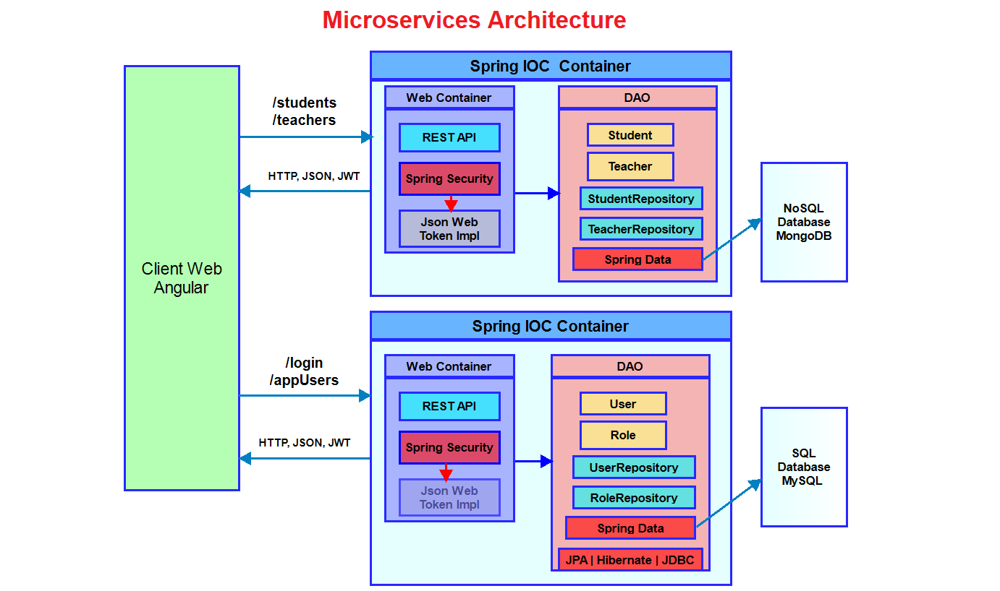

# Authentication microservice

#### *An authentication microservice written in Java using Spring Framework*

## Architecture

## Making a suggestion
We like improvements, but improvements are not bugs or issue.
We welcome public suggestions. Please contact me here [Email](paulhappi@yahoo.fr).

## Synopsis
- This microservice is an authentication system for your applications. 
- The microservice is very secure and robust. We have implemented JWT based Authentication technique in our application.
- Using Relation database MySQL us very easy to deploy on any server with best performance.

## Dependencies
- JAVA 8
- Tomcat 7,8,9 server
- Eclipse or Intellij IDEA
- Maven Dependency Management
- MySQL Database

## References
- [Spring Documentation](https://spring.io/)
- [Spring Security](https://docs.spring.io/spring-boot/docs/2.3.0.RELEASE/reference/htmlsingle/#boot-features-security)

## Installation
### Backend
 - In Eclipse import the project with option "import existing maven project".
 - Now build the maven project. It will install all the necessary dependencies from Internet.
 - To setup database, install MySQL in your system. Make any database.
 - Update the below three variables present in file **application.properties** present in **resources** folder
 >
 
     spring.datasource.url=jdbc:mysql://localhost:3306/db_users
     spring.datasource.username=root
     spring.datasource.password=root

 - Install Tomcat 9 and configure it with your project.
 - Run the project from **SecurityServiceApplication.java**, it will automatically create all the tables in your database.
 - The default users credentials are: 
 >
  
      admin / 1234
      user1 / 1234
      user2 / 1234
 
 - You need to login firt with **http://localhost:8080/login**
 - Find the users with **http://localhost:8080/appUsers**
 - Find the roles with **http://localhost:8080/appRoles**
 
 
##### Enjoy the microservice !!